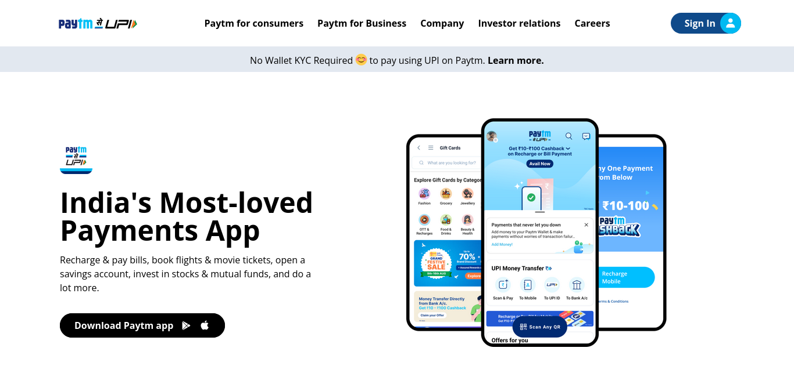
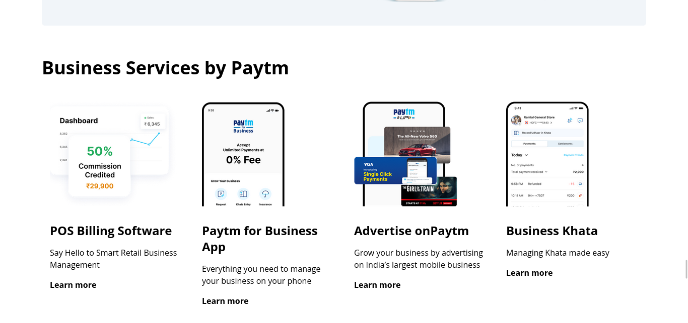

# Fully responsive paytm website clone

> By Aditya Kadali

## Built with:

- Semantic HTML5
- Tailwind CSS

## Links:

- [Live demo](https://paytm-clne.netlify.app/)
- [Source](https://github.com/Adityakadali/paytm-clone)

## Screenshots

- Desktop
  

  

- Mobile
  

## Time taken:

- This project took me 8+ hours to build from scratch

## Key Learnings:

- In this project I learned so much about responsive design. I learned about media queries and break points of different devices and how to optimise our design according to device.
