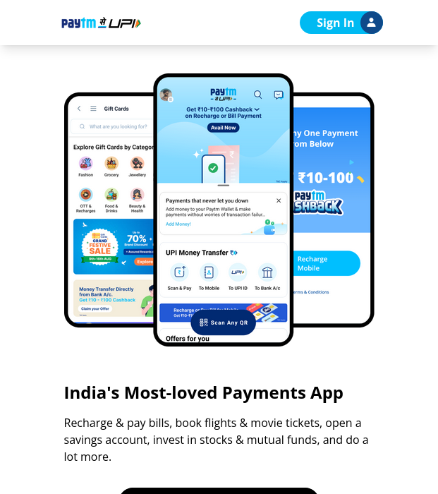

# Fully responsive paytm website clone

> By Aditya Kadali

## Disclaimer: 
- **THIS PAGE WAS MADE AS A PERSONAL EDUCATIONAL PROJECT**. This is **NOT** the official site of the company or brand identified on the page. The creator of this page is **NOT** affiliated with the company or brand in any way. This page is a personal project made in connection with an educational exercise.

## Screenshots

- Desktop
  

  

- Mobile

  

## Built with:

- Semantic HTML5
- Tailwind CSS

## Links:

- [Live demo](https://paytm-clne.netlify.app/)
- [Source](https://github.com/Adityakadali/paytm-clone)

## Time taken:

- This project took me 8+ hours to build from scratch

## Key Learnings:

- In this project I learned so much about responsive design. I learned about media queries and break points of different devices and how to optimise our design according to device.
